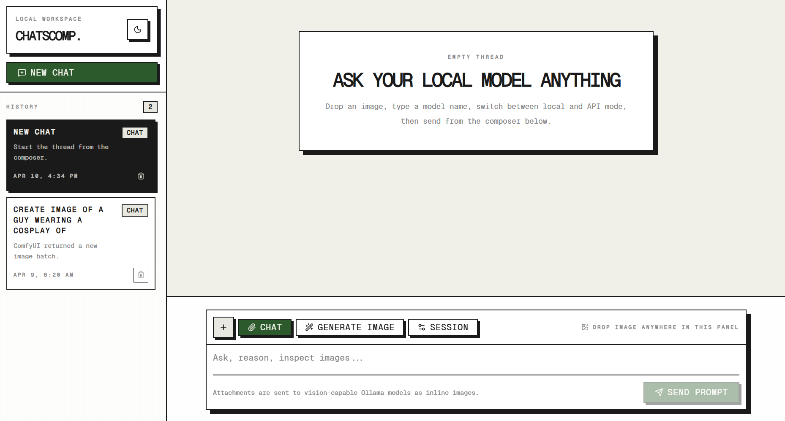

# ChatsComp

## What the app does

- chatting with local or remote Ollama models
- dropping image attachments into model conversations
- generating images through ComfyUI after the selected Ollama model refines the prompt

## Stack

- Bun for the local API layer
- React + Vite + TypeScript for the UI
- Tailwind CSS v4 plus the copied design system in `src/design-system`

## Run it

1. Copy `.env.example` to `.env` if you want to override defaults.
2. Install deps with `bun install`.
3. Start Ollama and ComfyUI locally.
4. Run `bun run dev`.

The app opens on `http://127.0.0.1:5173` and the Bun API listens on `http://127.0.0.1:3001`.
